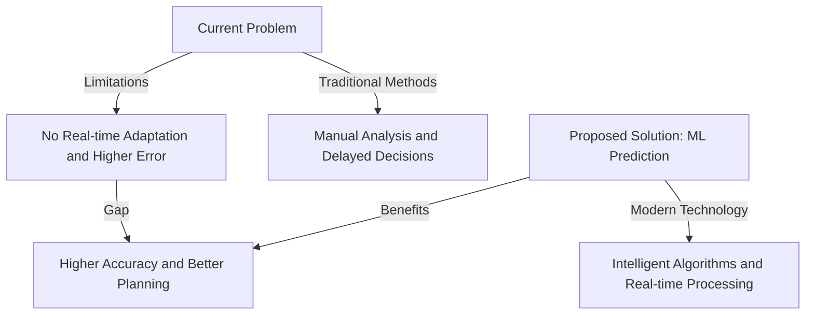
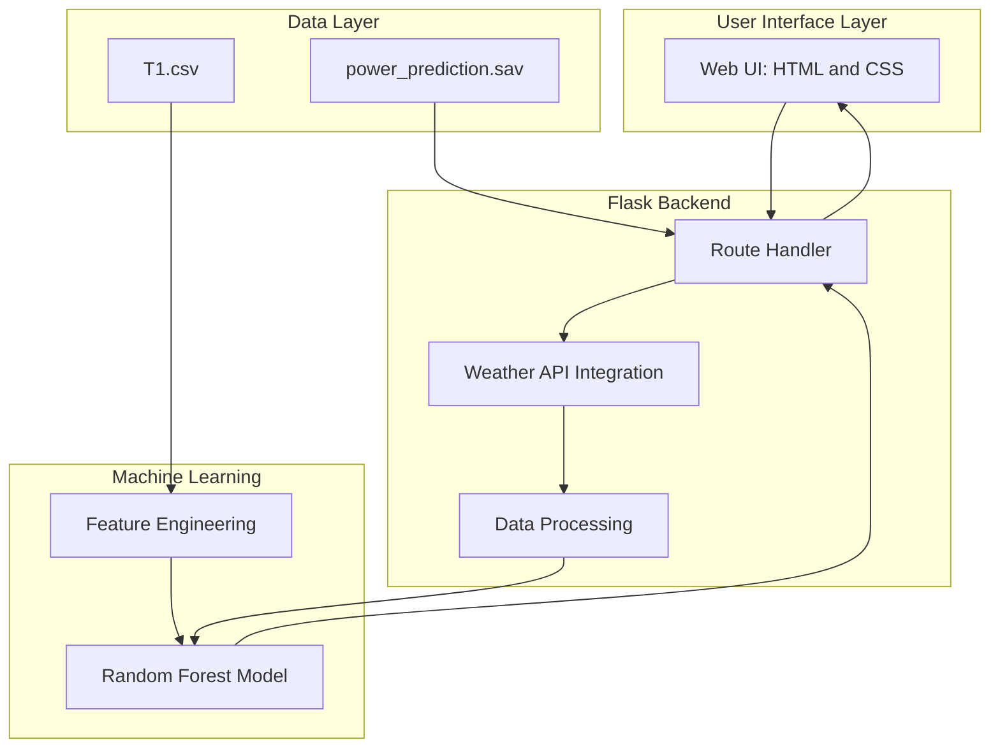
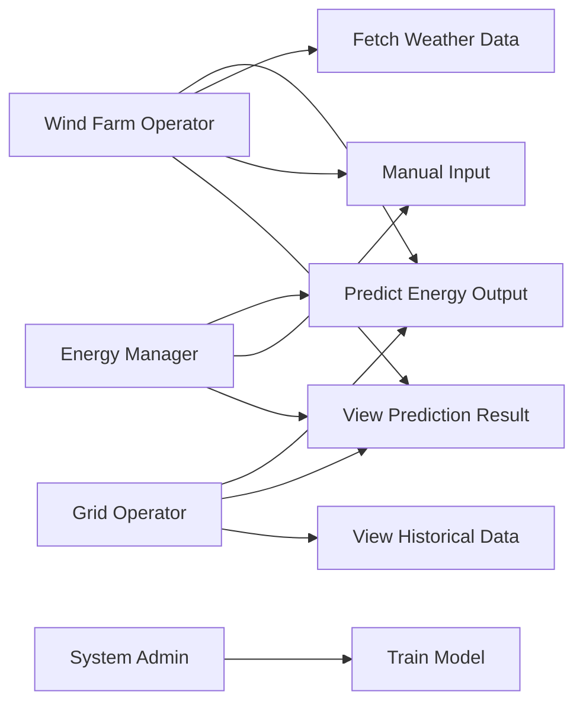
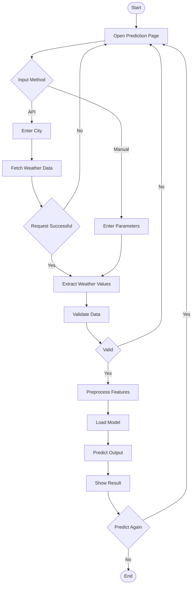
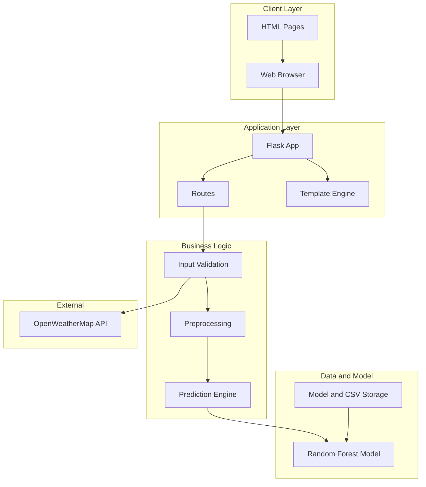

# 🌬️ Weather-Based Prediction of Wind Turbine Energy Output

<div align="center">

### ⚡ A Next-Generation Approach to Renewable Energy Management

[](https://www.python.org/)
[](https://flask.palletsprojects.com/)
[](https://scikit-learn.org/)
[](LICENSE)

**Harness the Power of Machine Learning to Predict Wind Turbine Energy Output**

*Using weather conditions to forecast renewable energy generation with high accuracy*

</div>

---

## 📌 Project Overview

This project focuses on **predicting the energy output of wind turbines based on weather conditions** using **Machine Learning and Flask**. Accurate energy prediction is crucial for renewable energy management, helping energy companies, wind farm operators, and grid operators make informed decisions.

By analyzing **historical wind and weather data**, a regression-based machine learning model is trained to predict turbine energy output under given weather conditions.

---

## 🎯 Problem Type

✔ **Regression Problem**
Because the output (energy in kWh) is a **continuous numerical value**, regression algorithms are used.

---

## ⚠️ Problem Statement

### The Challenge

Wind farms face significant operational challenges in predicting energy output and optimizing turbine performance. Traditional forecasting methods rely on historical averages and manual analysis, which lack precision and adaptability to dynamic weather conditions.

### 🔑 Key Highlights

#### 1. 🌍 **Importance of Renewable Energy**
- Renewable energy accounts for **25-30%** of global electricity generation
- Wind energy is the fastest-growing renewable source
- Accurate prediction reduces grid instability by **15-20%**
- Critical for achieving carbon neutrality goals (UN SDG 13)

#### 2. 🌪️ **Wind Energy's Dependency on Weather**
- Wind power output is **directly proportional** to wind speed (cubic relationship)
- Atmospheric pressure and temperature affect air density
- Humidity influences turbine efficiency by **5-8%**
- Weather-driven variability requires real-time prediction models

#### 3. 📊 **Need for Intelligent Prediction**
- Energy companies need **24-48 hour forecasts** for grid planning
- Maintenance scheduling requires **production predictions**
- Reduces energy wastage by **10-15%** through accurate planning
- Enables dynamic pricing based on predicted supply

### 📈 Problem Statement Diagram



---

## 🌍 Real-World Scenarios

### 🔹 Scenario 1: Energy Production Forecasting

Energy companies can forecast wind turbine energy production using weather forecasts, enabling:

* Efficient energy distribution
* Dynamic pricing decisions
* Reduced energy wastage

### 🔹 Scenario 2: Maintenance Planning

Wind farm operators can:

* Predict low-wind periods
* Schedule maintenance to minimize downtime
* Maximize turbine availability during high-wind periods

### 🔹 Scenario 3: Grid Integration

Grid operators can:

* Balance renewable and conventional energy sources
* Adjust grid load dynamically
* Ensure stable and efficient energy supply

---

## 🏗️ Technical Architecture

### System Architecture Overview

The system is designed with a multi-layered architecture for scalability and maintainability:



📄 **[Detailed Technical Architecture Diagram](outputs/diagrams/technical_architecture.md)**

### Use Case Diagram



📄 **[Complete Use Case Diagram](outputs/diagrams/use_case_diagram.md)**

### Activity Flow Diagram



📄 **[Complete Activity Diagram](outputs/diagrams/activity_diagram.md)**

### System Design Diagram



📄 **[Complete System Design Diagram](outputs/diagrams/system_design.md)**

---

## 🎯 Project Objectives

By completing this project, you will be able to:

* Identify whether a problem is **regression or classification**
* Perform **data preprocessing and cleaning**
* Visualize and analyze datasets for insights
* Apply suitable **machine learning algorithms**
* Train, test, and evaluate ML models
* Build a **Flask-based web application**
* Integrate ML models with a real-time UI

---

## 🔄 Project Flow

1. User interacts with the Web UI
2. Weather data is fetched (API integration)
3. Input is passed to the ML model
4. Model predicts wind turbine energy output
5. Prediction is displayed to the user

---

## 🧪 Project Phases

### 1️⃣ Data Collection

* Dataset collected from wind turbine historical records
* Stored in CSV format

### 2️⃣ Data Preprocessing

* Importing libraries
* Handling missing values
* Data cleaning and normalization
* Feature selection
* Train-test split

### 3️⃣ Data Visualization

* Wind speed vs power analysis
* Accuracy and performance graphs

### 4️⃣ Model Building

Regression algorithms used:

* **Random Forest Regression** (final model)

### 5️⃣ Model Evaluation

* Accuracy comparison
* Performance analysis on test data

### 6️⃣ Application Building

* HTML + CSS frontend
* Flask backend
* Model integration using `joblib`

---

## 🛠️ Technologies Used

### 🧠 Machine Learning

* Python
* Scikit-learn
* NumPy
* Pandas
* Matplotlib

### 🌐 Web Development

* Flask
* HTML
* CSS
* JavaScript

---

## 📦 Prerequisites

### Software Requirements

* Anaconda Navigator
* Python 3.x
* Jupyter Notebook / Spyder
* Web Browser

### Required Python Packages

Install from requirements.txt:

```bash
pip install -r requirements.txt
```

**Package List:**

* numpy==1.24.4
* pandas==2.0.3
* scipy==1.10.1
* scikit-learn==1.2.2
* joblib==1.3.2
* flask
* requests

---

## 📂 Project Structure

```text
Weather-Based-Prediction-of-Wind-Turbine-Energy-Output/
│
├── README.md
├── Procfile
├── runtime.txt
│
├── Document/
│   └── README.md
│
├── Project-Files/
│   ├── data/
│   │   └── T1.csv
│   │
│   ├── Flask-Wind-Mill-Power-Prediction/
│   │   ├── static/
│   │   │   ├── style.css
│   │   │   └── images/
│   │   │
│   │   ├── templates/
│   │   │   ├── intro.html
│   │   │   └── predict.html
│   │   │
│   │   ├── app.py
│   │   ├── windApp.py
│   │   └── power_prediction.sav
│   │
│   ├── power_prediction.sav
│   ├── Wind_mill_model.ipynb
│   ├── wind_turbine_energy_prediction.py
│   ├── test_model.py
│   └── requirements.txt
│
├── outputs/
│   ├── images/
│   │   └── [Generated Output Images]
│   │
│   └── diagrams/
│       ├── technical_architecture.md
│       ├── use_case_diagram.md
│       ├── activity_diagram.md
│       └── system_design.md
│
└── Video-Demo/
    └── README.md
```

---

## 🚀 How to Run the Project

### Step 1: Clone the Repository

```bash
git clone <repository-url>
cd Weather-Based-Prediction-of-Wind-Turbine-Energy-Output/Project-Files/Flask-Wind-Mill-Power-Prediction
```

### Step 2: Install Dependencies

```bash
pip install -r ../requirements.txt
```

Or install individually:

```bash
pip install numpy==1.24.4
pip install pandas==2.0.3
pip install scipy==1.10.1
pip install scikit-learn==1.2.2
pip install joblib==1.3.2
pip install flask
pip install requests
```

### Step 3: Run the Flask Application

```bash
python app.py
```

### Step 4: Access the Application

Open your web browser and navigate to:

```
http://127.0.0.1:5000/
```

---

## 💡 How to Use the Application

### Method 1: Using Weather API

1. Navigate to the prediction page
2. Enter a city name (e.g., "London", "New York")
3. Click "Fetch Weather Data"
4. The system will automatically retrieve weather parameters
5. Click "Predict Energy Output"
6. View the predicted energy output in kW

### Method 2: Manual Input

1. Navigate to the prediction page
2. Manually enter the following parameters:
   * Temperature (°C)
   * Humidity (%)
   * Pressure (mmHG)
   * Wind Speed (m/s)
3. Click "Predict Energy Output"
4. View the predicted energy output in kW

---

## 🎨 Features

* 🌤 Weather-based energy prediction
* 🔌 Weather API integration (OpenWeatherMap)
* ⏳ Loading animation
* 📊 Real-time prediction visualization
* ⚡ Live energy output prediction
* 📱 Responsive UI design
* 🎯 Manual input or API-based weather data

---

## 📸 Application Screenshots

### Landing Page


### Prediction Interface


### Prediction Results


---

## 📋 File Descriptions

### Main Files

* **app.py** - Main Flask application with routes and API integration
* **windApp.py** - Alternative Flask application implementation
* **Wind_mill_model.ipynb** - Jupyter notebook for model training and analysis
* **wind_turbine_energy_prediction.py** - Python script for model development
* **test_model.py** - Model testing and evaluation script
* **power_prediction.sav** - Trained machine learning model (joblib format)

### Data Files

* **data/T1.csv** - Wind turbine historical data for training

### Templates

* **intro.html** - Landing page template
* **predict.html** - Prediction page with input forms and results display

### Static Files

* **style.css** - Styling for the web application
* **images/** - Contains UI images and application screenshots

---

## 🔧 Model Details

The project uses **Random Forest Regression** as the final model for predicting wind turbine energy output. The model is trained on historical weather data including:

* Wind Speed (m/s)
* Temperature (°C)
* Humidity (%)
* Atmospheric Pressure (mmHG)

The trained model is saved using **joblib** and integrated with the Flask application for real-time predictions.

---

## 🌐 API Integration

The application integrates with **OpenWeatherMap API** to fetch real-time weather data for any city. Users can either:

1. Enter weather parameters manually
2. Fetch weather data automatically by entering a city name

**API Key**: The application uses OpenWeatherMap API (included in app.py)

---

## ✅ Conclusion

This project demonstrates how **machine learning and web technologies** can be combined to solve real-world renewable energy challenges. Predicting wind turbine energy output improves efficiency, planning, and grid stability, contributing to a more sustainable energy future.

---

## 👨‍💻 Developed By

**APSCHE AIML Project – Renewable Energy & Machine Learning**

### 👑 Team Lead
- **Aditya Indana** - Project Lead & Technical Architect

### 🏆 Development Team

| Role | Member | GitHub |
|------|--------|--------|
| **Team Lead** | Aditya Indana | [22MH1A42G1](https://github.com/22MH1A42G1) |
| **Developer** | KAMPARAPU SRI RAM | [22MH1A42G5](https://github.com/22MH1A42G5) |
| **Developer** | Vinay Charu Kirthan Rohit Kotha | [RohitKotha](https://github.com/RohitKotha) |
| **Developer** | Likhitha Hasini Chebolu | [22mh1a42h0](https://github.com/22mh1a42h0) |
| **Developer** | Mary Shakeena Meka | [maryshakeena](https://github.com/maryshakeena) |

### 📈 Project Contributions
- **Project Vision & Architecture** — Team Lead
- **Machine Learning Model Development** — Development Team
- **Web Application Development** — Development Team
- **Documentation & Testing** — Full Team

---

## 📞 Contact & Support

For questions, suggestions, or contributions, feel free to reach out:
- Create an issue in the repository
- Submit a pull request with improvements
- Contact the team lead for collaboration opportunities

---

*This project represents the collaborative effort of the APSCHE AIML team, demonstrating excellence in renewable energy technology and machine learning applications.*
