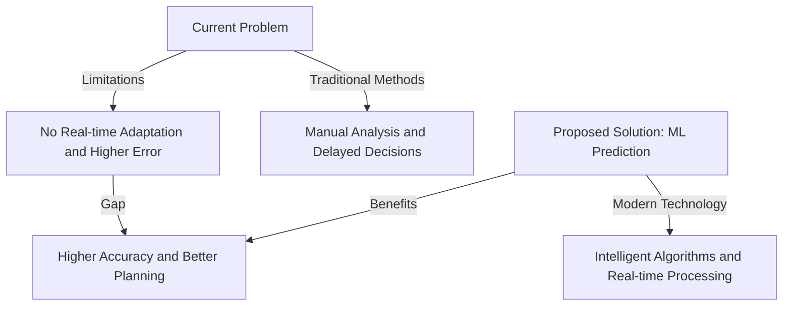
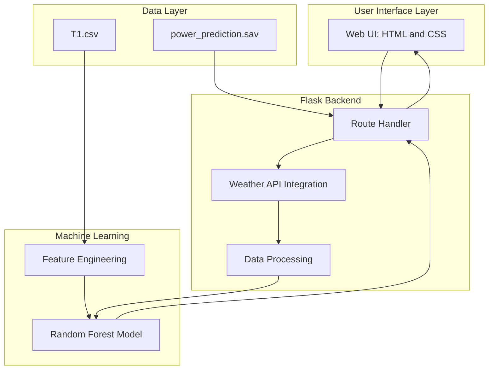
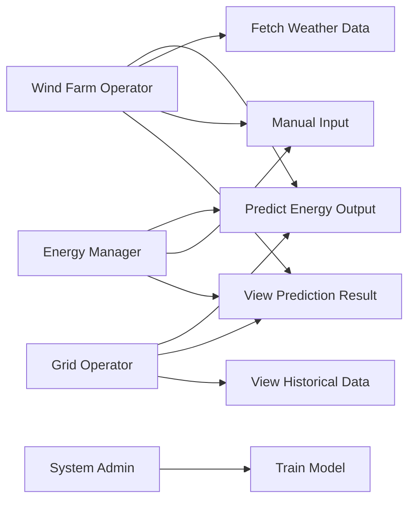
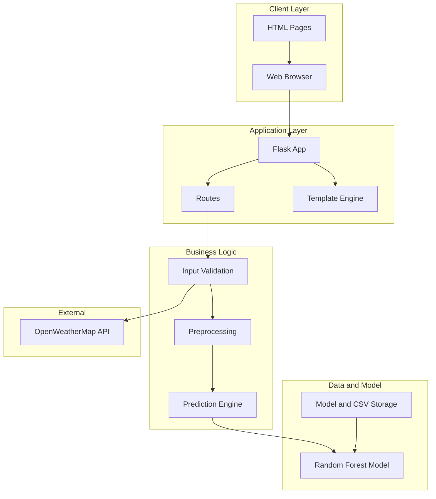

# 🌬️ Weather-Based Prediction of Wind Turbine Energy Output

<div align="center">

### ⚡ A Next-Generation Approach to Renewable Energy Management

[](https://www.python.org/)
[](https://flask.palletsprojects.com/)
[](https://scikit-learn.org/)
[](LICENSE)

**Harness the Power of Machine Learning to Predict Wind Turbine Energy Output**

*Using weather conditions to forecast renewable energy generation with high accuracy*

</div>

---

## 📌 Project Overview

This project aims to predict the energy output of wind turbines based on weather conditions using Machine Learning techniques integrated with a Flask web application. Accurate prediction of wind energy generation plays a vital role in efficient renewable energy management, enabling energy providers and grid operators to optimize power distribution and reduce dependency on conventional energy sources.

The system utilizes historical wind and meteorological data such as wind speed, temperature, pressure, and humidity to train a regression-based machine learning model. By learning patterns from past data, the model can estimate the expected turbine energy output for given weather conditions.

The trained model is deployed through a Flask-based web interface, allowing users to input weather parameters and receive real-time energy output predictions.

---

🎯 Problem Type

✔ Regression-Based Prediction

The objective of this project is to estimate wind turbine energy generation in kilowatt-hours (kWh). Since the output is a continuous numerical value rather than a category or label, regression algorithms are used to model and predict the energy output based on weather parameters.

⚠️ Problem Statement
The Core Challenge

Wind farms operate in highly dynamic environmental conditions, making it difficult to accurately estimate power generation. Conventional forecasting techniques often depend on past averages and simplified statistical approaches, which are not flexible enough to adapt to rapidly changing weather patterns.

An inaccurate prediction can lead to overproduction, underutilization, grid imbalance, or inefficient coordination with other power sources. Therefore, there is a strong need for a data-driven, intelligent prediction system that can provide reliable energy output estimates.

🔑 Key Aspects of the Problem
1. 🌍 Growing Importance of Renewable Energy

Renewable energy sources are becoming a major contributor to global electricity production. Among them, wind power is expanding rapidly due to its sustainability and low environmental impact.

Improving prediction accuracy supports:

Better grid stability
Reduced dependence on fossil fuels
Lower carbon emissions
Efficient integration of renewable energy into existing power systems
Accurate forecasting plays a crucial role in supporting global climate action and sustainable development goals.

2. 🌪️ Dependence of Wind Energy on Weather Conditions

Wind turbine performance is highly sensitive to environmental factors.
Power generation increases significantly with wind speed, following a nonlinear relationship.
Temperature and atmospheric pressure influence air density, which directly affects turbine efficiency.
Humidity and other atmospheric conditions can slightly alter overall energy production.
Sudden weather fluctuations create uncertainty in power output.
Because of this variability, traditional static models are insufficient, and intelligent prediction systems are required.

4. 📊 Need for Smart and Data-Driven Forecasting
   
Energy providers require short-term and medium-term predictions to manage operations effectively. Accurate forecasting enables:
Better scheduling of power distribution
Coordination with conventional power plants
Efficient maintenance planning
Reduction of energy wastage
Improved pricing strategies based on expected supply
By applying machine learning techniques, we can build a system capable of learning from historical data and generating reliable predictions for future energy output.

### 📈 Problem Statement Diagram



---

## 🌍 Real-World Scenarios

### 🔹 Scenario 1: Energy Production Forecasting

Energy companies can forecast wind turbine energy production using weather forecasts, enabling:

* Efficient energy distribution
* Dynamic pricing decisions
* Reduced energy wastage

### 🔹 Scenario 2: Maintenance Planning

Wind farm operators can:

* Predict low-wind periods
* Schedule maintenance to minimize downtime
* Maximize turbine availability during high-wind periods

### 🔹 Scenario 3: Grid Integration

Grid operators can:

* Balance renewable and conventional energy sources
* Adjust grid load dynamically
* Ensure stable and efficient energy supply

---

## 🏗️ Technical Architecture

### System Architecture Overview

The system is designed with a multi-layered architecture for scalability and maintainability:



📄 **[Detailed Technical Architecture Diagram](outputs/diagrams/technical_architecture.md)**

### Use Case Diagram



📄 **[Complete Use Case Diagram](outputs/diagrams/use_case_diagram.md)**

### Activity Flow Diagram


📄 **[Complete Activity Diagram](outputs/diagrams/activity_diagram.md)**

### System Design Diagram



📄 **[Complete System Design Diagram](outputs/diagrams/system_design.md)**

---

##Project Objectives

The primary goal of this project is to develop a practical understanding of how machine learning can be applied to real-world renewable energy challenges. Through this implementation, we aim to:
Determine the appropriate problem type (regression vs. classification) based on the nature of the output
Clean and preprocess raw weather data to prepare it for model training
Explore and visualize the dataset to uncover patterns and relationships
Select and implement suitable machine learning algorithms for prediction
Train, validate, and evaluate model performance using appropriate metrics
Design and develop a user-friendly web interface using Flask
Deploy the trained model within a web application for interactive predictions
This project combines data science, machine learning, and web development into a complete end-to-end solution.

🔄 Project Workflow

The system operates through the following sequence:
The user enters weather-related inputs through the web interface.
Relevant weather parameters are either manually provided or retrieved through an API integration.
The processed inputs are forwarded to the trained machine learning model.
The model analyzes the inputs and estimates the expected wind turbine energy output.
The predicted result is displayed dynamically on the web application for the user.

## 🧪 Project Phases

### 1️⃣ Data Collection

* Dataset collected from wind turbine historical records
* Stored in CSV format

### 2️⃣ Data Preprocessing

* Importing libraries
* Handling missing values
* Data cleaning and normalization
* Feature selection
* Train-test split

### 3️⃣ Data Visualization

* Wind speed vs power analysis
* Accuracy and performance graphs

### 4️⃣ Model Building

Regression algorithms used:

* **Random Forest Regression** (final model)

### 5️⃣ Model Evaluation

* Accuracy comparison
* Performance analysis on test data

### 6️⃣ Application Building

* HTML + CSS frontend
* Flask backend
* Model integration using `joblib`

---

## 🛠️ Technologies Used

### 🧠 Machine Learning

* Python
* Scikit-learn
* NumPy
* Pandas
* Matplotlib

### 🌐 Web Development

* Flask
* HTML
* CSS
* JavaScript

---

## 📦 Prerequisites

### Software Requirements

* Anaconda Navigator
* Python 3.x
* Jupyter Notebook / Spyder
* Web Browser

### Required Python Packages

Install from requirements.txt:

```bash
pip install -r requirements.txt
```

**Package List:**

* numpy==1.24.4
* pandas==2.0.3
* scipy==1.10.1
* scikit-learn==1.2.2
* joblib==1.3.2
* flask
* requests

---

## 📂 Project Structure

```text
Weather-Based-Prediction-of-Wind-Turbine-Energy-Output/
│
├── README.md
├── Procfile
├── runtime.txt
│
├── Document/
│   └── README.md
│
├── Project-Files/
│   ├── data/
│   │   └── T1.csv
│   │
│   ├── Flask-Wind-Mill-Power-Prediction/
│   │   ├── static/
│   │   │   ├── style.css
│   │   │   └── images/
│   │   │
│   │   ├── templates/
│   │   │   ├── intro.html
│   │   │   └── predict.html
│   │   │
│   │   ├── app.py
│   │   ├── windApp.py
│   │   └── power_prediction.sav
│   │
│   ├── power_prediction.sav
│   ├── Wind_mill_model.ipynb
│   ├── wind_turbine_energy_prediction.py
│   ├── test_model.py
│   └── requirements.txt
│
├── outputs/
│   ├── images/
│   │   └── [Generated Output Images]
│   │
│   └── diagrams/
│       ├── technical_architecture.md
│       ├── use_case_diagram.md
│       ├── activity_diagram.md
│       └── system_design.md
│
└── Video-Demo/
    └── README.md
```

---

## 🚀 How to Run the Project

### Step 1: Clone the Repository

```bash
git clone <repository-url>
cd Weather-Based-Prediction-of-Wind-Turbine-Energy-Output/Project-Files/Flask-Wind-Mill-Power-Prediction
```

### Step 2: Install Dependencies

```bash
pip install -r ../requirements.txt
```

Or install individually:

```bash
pip install numpy==1.24.4
pip install pandas==2.0.3
pip install scipy==1.10.1
pip install scikit-learn==1.2.2
pip install joblib==1.3.2
pip install flask
pip install requests
```

### Step 3: Run the Flask Application

```bash
python app.py
```

### Step 4: Access the Application

Open your web browser and navigate to:

```
http://127.0.0.1:5000/
```

---

## 💡 How to Use the Application

### Method 1: Using Weather API

1. Navigate to the prediction page
2. Enter a city name (e.g., "London", "New York")
3. Click "Fetch Weather Data"
4. The system will automatically retrieve weather parameters
5. Click "Predict Energy Output"
6. View the predicted energy output in kW

### Method 2: Manual Input

1. Navigate to the prediction page
2. Manually enter the following parameters:
   * Temperature (°C)
   * Humidity (%)
   * Pressure (mmHG)
   * Wind Speed (m/s)
3. Click "Predict Energy Output"
4. View the predicted energy output in kW

---

## 🎨 Features

* 🌤 Weather-based energy prediction
* 🔌 Weather API integration (OpenWeatherMap)
* ⏳ Loading animation
* 📊 Real-time prediction visualization
* ⚡ Live energy output prediction
* 📱 Responsive UI design
* 🎯 Manual input or API-based weather data

---

## 📸 Application Screenshots

### Landing Page


### Prediction Interface


### Prediction Results


---

## 📋 File Descriptions

### Main Files

* **app.py** - Main Flask application with routes and API integration
* **windApp.py** - Alternative Flask application implementation
* **Wind_mill_model.ipynb** - Jupyter notebook for model training and analysis
* **wind_turbine_energy_prediction.py** - Python script for model development
* **test_model.py** - Model testing and evaluation script
* **power_prediction.sav** - Trained machine learning model (joblib format)

### Data Files

* **data/T1.csv** - Wind turbine historical data for training

### Templates

* **intro.html** - Landing page template
* **predict.html** - Prediction page with input forms and results display

### Static Files

* **style.css** - Styling for the web application
* **images/** - Contains UI images and application screenshots

---

## 🔧 Model Details

The project uses **Random Forest Regression** as the final model for predicting wind turbine energy output. The model is trained on historical weather data including:

* Wind Speed (m/s)
* Temperature (°C)
* Humidity (%)
* Atmospheric Pressure (mmHG)

The trained model is saved using **joblib** and integrated with the Flask application for real-time predictions.

---

## 🌐 API Integration

The application integrates with **OpenWeatherMap API** to fetch real-time weather data for any city. Users can either:

1. Enter weather parameters manually
2. Fetch weather data automatically by entering a city name

**API Key**: The application uses OpenWeatherMap API (included in app.py)

---

## ✅ Conclusion

This project demonstrates how **machine learning and web technologies** can be combined to solve real-world renewable energy challenges. Predicting wind turbine energy output improves efficiency, planning, and grid stability, contributing to a more sustainable energy future.

---

## 👨‍💻 Developed By

**APSCHE AIML Project – Renewable Energy & Machine Learning**

### 👑 Team Lead
- Seela Navya Sri Priya
### Other Members
- Suvvari Sairaj
- Karanam Purna Chandra Rao
- Sekali Mounika


*This project represents the collaborative effort of the APSCHE AIML team, demonstrating excellence in renewable energy technology and machine learning applications.*

