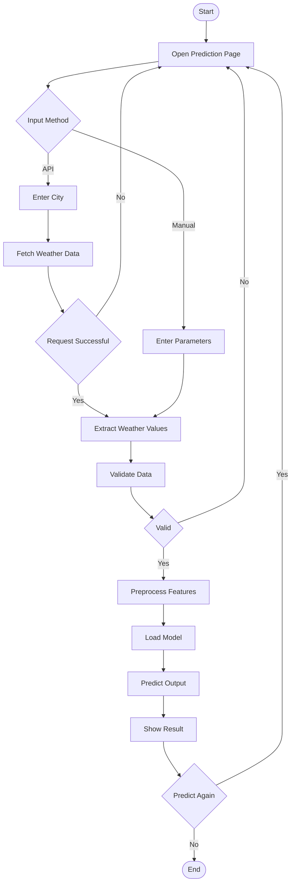

# Activity Diagram - Wind Energy Prediction Flow

## Prediction Flow Stages

| Stage | Activity | Status |
|-------|----------|--------|
| **Input** | User selects prediction method and provides data | 🔵 Initial |
| **Validation** | System validates input parameters and format | 🟡 Processing |
| **Preparation** | Features are normalized and scaled for ML model | 🟡 Processing |
| **Prediction** | Random Forest model generates energy output | 🔵 Critical |
| **Output** | Results formatted and displayed to user | 🟢 Final |
