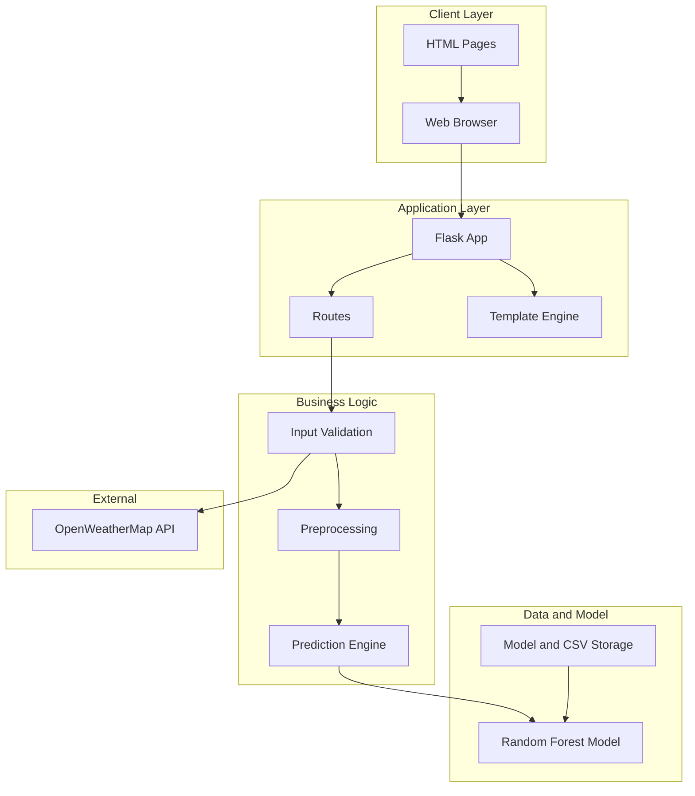

# System Design Diagram

## System Components Architecture

### Client Layer
| Component | Role |
|-----------|------|
| **Web Browser** | User interface rendering |
| **HTML Templates** | UI structure and forms |
| **CSS Stylesheets** | Visual styling and responsiveness |
| **JavaScript** | Dynamic interactions and validations |

### Application Layer
| Component | Role |
|-----------|------|
| **Flask App** | Request handling and routing |
| **Route Handlers** | URL routing logic |
| **Jinja2 Engine** | Dynamic template rendering |

### Business Logic Layer
| Component | Role |
|-----------|------|
| **Validation** | Input verification and sanitization |
| **Preprocessing** | Feature normalization and scaling |
| **Prediction Engine** | ML model inference |

### Data & Model Layer
| Component | Role |
|-----------|------|
| **ML Model** | Random Forest Regression engine |
| **Feature Scaler** | StandardScaler for normalization |
| **Joblib** | Model serialization/deserialization |

### Storage Layer
| Component | Role |
|-----------|------|
| **CSV Database** | Historical training data |
| **Model Store** | Serialized model files |
