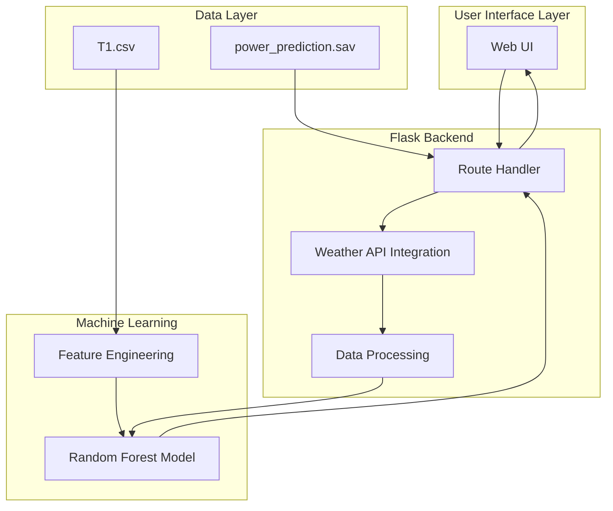

# Technical Architecture Diagram

## Architecture Components

| Component | Technology | Purpose |
|-----------|-----------|---------|
| **Frontend** | HTML5, CSS3, JavaScript | User interface for data input & result display |
| **Backend** | Flask, Python | Route handling, API integration, data processing |
| **ML Engine** | Scikit-learn, Joblib | Model training, prediction, serialization |
| **Data Processing** | NumPy, Pandas, SciPy | Feature engineering, normalization |
| **External APIs** | OpenWeatherMap | Real-time weather data retrieval |
| **Data Storage** | CSV, Joblib | Historical data & trained model persistence |
