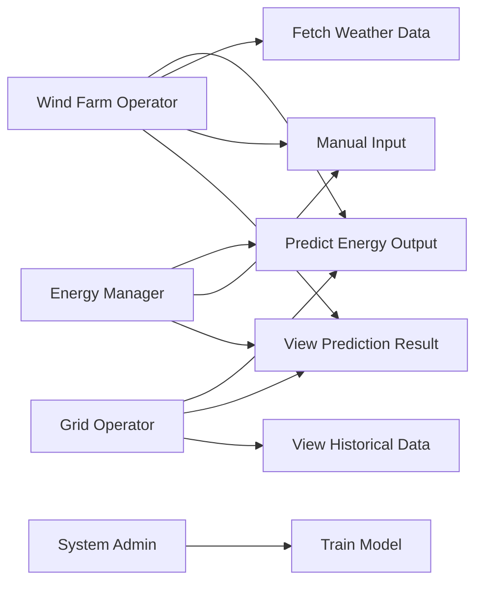

# Use Case Diagram

## Use Case Scenarios

### 1. **Wind Farm Operator**
- Predict daily energy output for turbine maintenance planning
- Fetch real-time weather data automatically
- Manually input weather parameters for offline predictions
- View prediction results for scheduling purposes

### 2. **Grid Operator**
- Predict aggregate wind energy production
- Balance renewable and conventional energy sources
- Monitor historical production patterns
- Plan grid load distribution

### 3. **Energy Manager**
- Forecast energy availability for pricing decisions
- Input specific weather scenarios
- Compare predictions with actual output
- Optimize energy distribution strategy

### 4. **System Administrator**
- Train and retrain ML models with new data
- Maintain API integration
- Monitor system performance
- Manage database and backups
